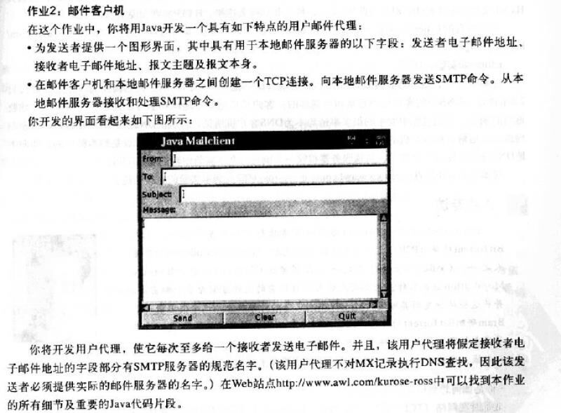
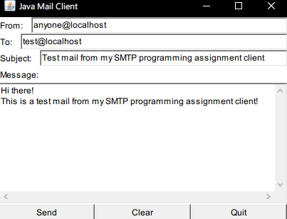
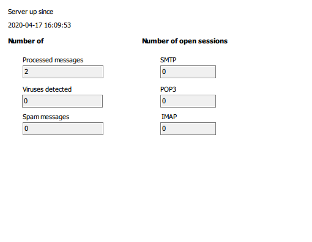
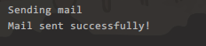
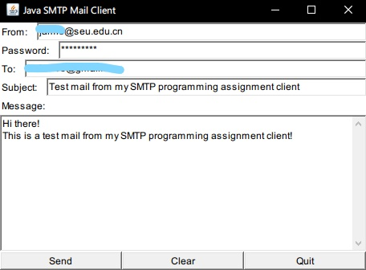
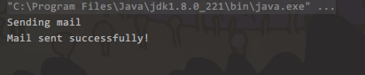
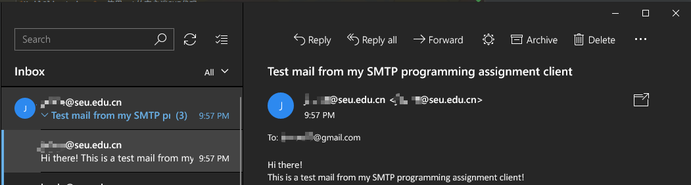

# A Simple SMTP Mail User Agent in Java
实现了《计算机网络：自顶向下方法（第四版）》中的“第二章-作业2：邮件客户机”。

## 要求

## 无登录版本
**此版本源码在*noAuth/src*中。**

根据原书的题目要求，该客户端能实现最基本的SMTP协议功能，但仅能在本地发送和接受邮件。存放本作业细节和重要代码片段的“Web站点”已经失效，但仍能在[有些学校的网站里](https://inst.eecs.berkeley.edu/~ee122/sp06/ProgAsgns/lab2.html)找到此资源。此版本内容根据本资源的指导完成。

### 说明

[`MailClient.java`](noAuth/src/MailClient.java): 使用awt的客户端GUI代码。

[`Message.java`](noAuth/src/Message.java): 将GUI中的输入转换成邮件报文的代码。

[`Envelope.java`](noAuth/src/Envelope.java): 封装报文的代码。

[`SMTPConnection.java`](noAuth/src/SMTPConnection.java) 建立TCP连接和发送邮件的代码。

本客户端只可以在使用本地host发送给一个在本地运行的邮件服务器，用来测试的SMTP服务器的客户端，比如[hMailServer](https://www.hmailserver.com/)。发送邮件成功将会在终端里输出消息。

### 演示

运行主程序：

发送前邮件客户端：

点击“Send",发送成功: 

发送后邮件客户端：

## 登录SMTP服务器版本

**此版本源码在*auth/src*中。**

为了能够真正给正常的邮箱发送邮件，此版本通过登录发件SMTP服务器发送给目标服务器。

### 说明

[`MailClient.java`](auth/src/MailClient.java): 使用awt的客户端GUI代码。

[`Message.java`](auth/src/Message.java): 将GUI中的输入转换成邮件报文的代码。

[`Envelope.java`](auth/src/Envelope.java): 封装报文的代码。

[`SMTPConnection.java`](auth/src/SMTPConnection.java) 建立TCP连接，登录发件人SMTP服务器，发送邮件的代码。

**！！默认发件人"xxx@yyy"的邮箱的SMTP服务器地址为smtp.yyy，比如someone@seu.edu.cn，解析其发件SMTP服务器地址为smtp.seu.edu.cn。**

**发件邮箱必须支持直接通过SMTP发件，比如SEU邮箱。**

### 演示

运行主程序: 

点击发送后，发送成功：

收件邮箱收到：